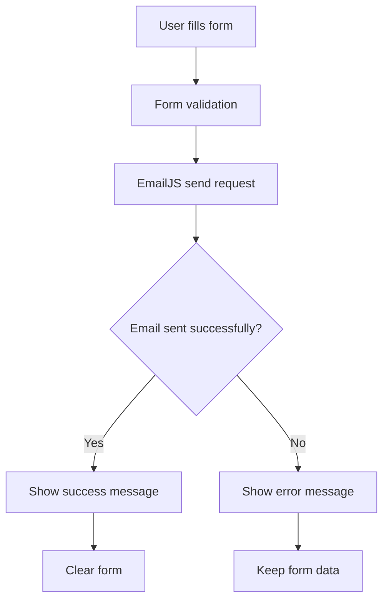

# Commission Request Button Implementation Plan

## Overview
This plan outlines the implementation of a functional "Send Commission Request" button using EmailJS, a client-side email service that works perfectly with static sites deployed on GitHub Pages.

## Current State Analysis

### Existing Infrastructure
- **Frontend**: React 19.1.1 application with React Router
- **Deployment**: GitHub Pages (static hosting)
- **Contact Form**: Already implemented in `src/pages/Contact.js`
- **Form Fields**: Name, email, phone, project type, size selection, message
- **Current Functionality**: Form submission only logs to console

### Form Structure
The existing contact form includes:
- Personal information (name, email, phone)
- Project type selection (personal icon, family icon, church commission, etc.)
- Conditional size selection with pricing
- Detailed message field
- Professional styling and validation

## Implementation Strategy

### 1. EmailJS Integration Approach
**Why EmailJS?**
- No backend required (perfect for GitHub Pages)
- Client-side email sending
- Free tier supports 200 emails/month
- Easy integration with React
- Reliable service with good documentation

### 2. Technical Architecture



### 3. Email Template Design
The email will include:
- **Subject**: "New Commission Request from [Name]"
- **Client Information**: Name, email, phone
- **Project Details**: Type, size (if applicable), detailed message
- **Pricing Information**: Automatically included based on size selection
- **Timestamp**: When the request was submitted

### 4. User Experience Flow

1. **Form Submission**
   - User clicks "Send Commission Request"
   - Button shows loading state
   - Form validation runs

2. **Processing**
   - EmailJS sends email in background
   - Loading indicator active

3. **Success State**
   - Green success message appears
   - Form clears automatically
   - Button returns to normal state

4. **Error State**
   - Red error message appears
   - Form data preserved
   - User can retry submission

## Implementation Details

### Phase 1: Setup and Configuration
1. **EmailJS Account Setup**
   - Create account at emailjs.com
   - Set up email service (Gmail/Outlook)
   - Create email template
   - Get service ID, template ID, and public key

2. **Environment Configuration**
   - Add EmailJS credentials to environment variables
   - Configure for both development and production

### Phase 2: Code Implementation
1. **Install Dependencies**
   ```bash
   npm install @emailjs/browser
   ```

2. **Update Contact Component**
   - Import EmailJS
   - Add state management for loading/success/error
   - Implement email sending function
   - Add form reset functionality

3. **Enhanced Form Validation**
   - Client-side validation before submission
   - Email format validation
   - Required field checking
   - Project type specific validation

### Phase 3: User Interface Enhancements
1. **Loading States**
   - Button loading spinner
   - Disabled form during submission
   - Visual feedback for user

2. **Message System**
   - Success message component
   - Error message component
   - Auto-dismiss functionality

3. **Styling Integration**
   - Match existing design system
   - Responsive message displays
   - Accessibility considerations

### Phase 4: Testing and Optimization
1. **Functional Testing**
   - Test all project types
   - Test with/without optional fields
   - Test error scenarios

2. **Performance Optimization**
   - Lazy load EmailJS
   - Optimize bundle size
   - Error boundary implementation

## Security Considerations

### EmailJS Security
- Public key is safe to expose (designed for client-side)
- Rate limiting handled by EmailJS
- No sensitive data stored in frontend
- Email validation prevents spam

### Form Security
- Client-side validation (UX)
- Server-side validation via EmailJS
- Input sanitization
- CSRF protection not needed (stateless)

## Error Handling Strategy

### Network Errors
- Retry mechanism for failed requests
- Clear error messages for users
- Fallback contact information display

### Validation Errors
- Real-time field validation
- Clear error indicators
- Helpful error messages

### Rate Limiting
- Graceful handling of EmailJS limits
- User-friendly messaging
- Alternative contact methods

## Monitoring and Analytics

### Success Metrics
- Form submission success rate
- Email delivery confirmation
- User completion rate

### Error Tracking
- Failed submission logging
- Network error monitoring
- User experience metrics

## Future Enhancements

### Potential Improvements
1. **Auto-save Draft**: Save form data locally
2. **File Attachments**: Allow reference images
3. **Calendar Integration**: Schedule consultation calls
4. **Progress Tracking**: Commission status updates
5. **Payment Integration**: Deposit handling

### Scalability Considerations
- EmailJS limits (200 emails/month free)
- Upgrade path to paid plans
- Alternative email services backup
- Backend migration strategy

## Risk Mitigation

### Technical Risks
- **EmailJS Service Downtime**: Display alternative contact methods
- **Rate Limit Exceeded**: Clear messaging and alternative options
- **Email Delivery Issues**: Confirmation system and follow-up

### User Experience Risks
- **Form Data Loss**: Auto-save implementation
- **Slow Network**: Loading states and timeouts
- **Mobile Compatibility**: Responsive design testing

## Success Criteria

### Functional Requirements
- ✅ Form submits successfully via EmailJS
- ✅ Email received with all form data
- ✅ Success message displayed to user
- ✅ Form clears after successful submission
- ✅ Error handling for failed submissions

### Non-Functional Requirements
- ✅ Response time under 3 seconds
- ✅ Mobile-responsive design
- ✅ Accessible to screen readers
- ✅ Works across all major browsers
- ✅ Maintains existing design consistency

## Timeline Estimate

- **Setup & Configuration**: 1-2 hours
- **Core Implementation**: 2-3 hours
- **UI/UX Enhancements**: 1-2 hours
- **Testing & Refinement**: 1-2 hours
- **Documentation**: 30 minutes

**Total Estimated Time**: 5-9 hours

## Next Steps

1. Review and approve this implementation plan
2. Switch to Code mode to begin implementation
3. Start with EmailJS account setup and configuration
4. Implement core functionality step by step
5. Test thoroughly before deployment

This plan provides a solid foundation for implementing a professional, reliable commission request system that enhances the user experience while maintaining the simplicity of the current static site architecture.